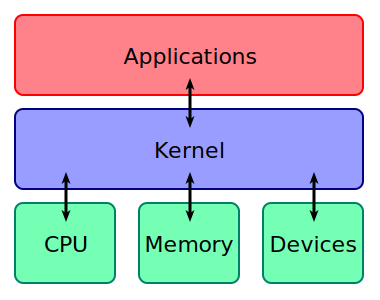
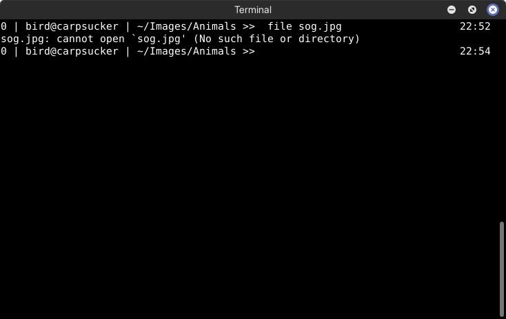

# Intro to Linux
Cormac Sharkey

---

## Who am I?
- UCC goblin & wheel person
- UWA graduate
- Professional computer wrangler
- Bird enthusiast
- github.com/bir-d

---

## What is Linux?
- A kernel
- Not necessarily an OS
- But a major building block towards one
 *A little bit like this!*
###### Bobbo, CC BY-SA 3.0 <https://creativecommons.org/licenses/by-sa/3.0>, via Wikimedia Commons

---

## Why does this matter?

---

## Linux

---

## (also) Linux

---

## (I can't believe it's still) Linux

---

## Archaic but effective

---

## The main takeaway
Pretty much *everything* is just a bunch of smaller programs stuck together
(I wish it was this nice...)

---

## Let's talk more about the shell
 (this thing)

---

## Let's talk more about the shell
- (yet another) program
- Also known as a "command line" or "terminal"
- Multiple available
    - The most popular of which is `bash`
- What is this useful for?
    - Running more programs of course!
    - Let's go run one

--- 

## Commands...

---

## Another one

---

## Introducing flags

---

## Introducing flags
Alters a programs *behaviour*
- ls
    - Prints all non-hidden files in the current directory
- ls **-l**
    - Prints all non-hidden files, as well as additional information.
- You can string these together
    - Try `ls -l -t -r -a -p`
        - shorter: `ls -ltrap`
- The manual page lists all of the flags (and more!) for any program with an entry
    - Try `man`, and pass it a programs name as its first argument! (`man ls`)

---

## Anatomy of a command
Essentially: name of program, any required *flags*, then as many required *arguments* as input
- You can then do all sorts of stuff with the output!
    - But this is a whole other can of worms (and might lead you down the evil path of becoming a sysadmin)

Common patterns?
- `program`
- `program` `FLAGS` `TARGET`
- `program` `FLAGS` `SOURCE` `DESTINATION`

---

## Teaching you how to fish

---

## Teaching you how to fish
1. Figure out what your problem is
2. Figure out what program you need to care about
3. Look it up lol

---

## An easy example

 (`file` just prints out the file type of it's argument)

---

## An easy example

1. Figure out what your problem is

---

## An easy example
2. Figure out what program you need to care about
