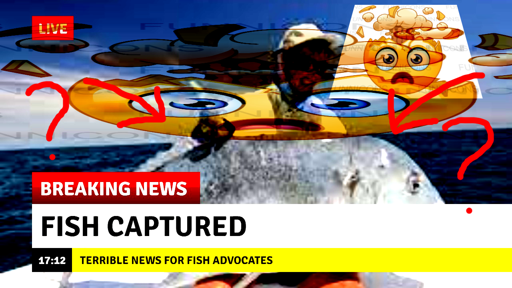

# Intro to Linux
Cormac Sharkey

---

## Who am I?
- UCC committee/wheel person
- UWA graduate, soon to be professional computer wrangler
- github.com/bir-d

---

## What is Linux?
- A kernel
- Not necessarily an OS
- But a major building block towards one
 *A little bit like this!*
###### Bobbo, CC BY-SA 3.0 <https://creativecommons.org/licenses/by-sa/3.0>, via Wikimedia Commons

---

## So what are these "distros" I keep hearing about?
- A distro (distribution) is simply Linux + a bunch of other programs to help you get things done.
- For example, Ubuntu is Linux + a desktop environment (GNOME) + a bunch of other stuff.
- As a result....

---

## Linux

---

## (also) Linux

---

## (I can't believe it's still) Linux

---

## Archaic but effective

---

## A reoccuring theme
Pretty much *everything* is just a bunch of smaller programs stuck together
(I wish it was this nice...)

---
## The key
**Understand which of these programs you care about and how to interact with them.**

---

## Let's talk more about the shell
 (this thing)

---

## Why?

- We need some way to get stuff done on the computer, and
    - As we've seen, a graphical environment is *nice*, but **not guaranteed!**
        - Linux with no display manager or window manager installed is still Linux!
- However, the shell is typically always available -- and ubiquitous across every distro.
- The shell is also **VERY GOOD** at interacting with very specific programs -- in very specific ways.
---

## What is the shell?
- (yet another) program
- Also known as a "command line" or "terminal"
- Multiple available
    - The most popular of which is `bash`
      - It's worth noting that MacOS also uses this!
- Most often, this will be run on your own computer (local shell), or you will be interacting with a remote shell (via SSH)

--- 

## Let's talk about commands
Essentially: the name of a program, any required *flags*, then as many required *arguments* as input
- You can then do all sorts of stuff with the output!

Common patterns?
- `program`
- `program` `FLAGS` `TARGET`
- `program` `FLAGS` `SOURCE` `DESTINATION`
---

## Commands...

---

## Another one

---

## Introducing flags
Alters a programs *behaviour*
- ls
    - Prints all non-hidden files in the current directory
- ls **-l**
    - Prints all non-hidden files, as well as additional information.
- You can string these together
    - Try `ls -l -t -r -a -p`
        - shorter: `ls -ltrap`
- The manual page lists all of the flags (and more!) for any program with an entry
    - Try `man`, and pass it a programs name as its first argument! (`man ls`)

---

## Introducing flags

---

## The file tree
- Programs will typically operate on files!
- Files sit in your filesystem
- Visualise this as a tree!

---

## The file tree

---

## The file tree

---
## Referencing files
- When referring to files, you will typically refer to an *absolute* or *relative* path to the file
  - Think of a file path as directions to a file.
- So far you've seen what is called an *absolute path*
    - This is a path which specifies a file from the root `/` allll the way to the destination!
    - For example:

---
## Absolute file path

---
## Absolute file path

---
## Absolute file path

---

## Absolute file path

---

## Absolute file path

---

## Absolute file path
- Lets use our path to `dog.jpg` and supply it to `tiv`, a program for viewing images on the terminal

---

## More on file paths
- A good thing about absolute file paths is that there's *no* ambiguity.
- If you specify the whole path, from the root, every time, the file can be in only *one* place.
  - Follow the tree!
- They can be tedious to type though, especially when your path is more than a few folders long.
- The solution: relative paths!

---

## Relative? Relative to what?
- A relative path is relative to your *current working directory*
  - This is just a way of expressing "the folder you are in currently"
- To construct a relative path, just express directions from your current working directory to the file in question.
- In the case of `/home/bird/pics/dog.jpg`:
  - If my current working directory is `/home/bird/`, I can specify a relative path as `pics/dog.jpg`
  - If my current working directory is `/home/bird/pics`, I can specify a relative path as just `dog.jpg` (!!!)

---

## Saving more time with shortcuts
- What if building relative paths is still too slow for me?
- There are shortcuts...
- `~`: represents your home directory
  - `~` == `/home/bird`
  - `~/pics` == `/home/bird/pics`
- `.`: represents your current working directory
  - This is implicit when specifying most relative paths: `./dog.jpg` == `dog.jpg`
- `..`: represents the folder *above* your current working directory!
  - If your CWD is `/home/bird/pics`, `..` == `/home/bird`

---

## Teaching you how to fish

---

## Teaching you how to fish
- By now, we've talked about the shell, how to construct commands, and how to refer to files.
- I could go over how to accomplish all sorts of tasks
  - But there are far too many for the time provided in this talk.
  - And theres no guarantee that this would even apply to the distribution of Linux you're using!
  
---

## This doesn't matter though, because:
- Most tasks you need to do can be worked out logically, and
- You now have the tools to do this!

---

## Let's go fishing

- Google is still your friend!
- In terms of getting a starting point for a lot of problems, it is *invaluable*
- However, it won't find everything.
  - This is where you need to strike a balance between reliance on it's results, and tailoring it to your needs.

---
## Quick note on where to fish
- Generally, things will boil down to interacting with a program, or editing a file.
- So a lot of solutions on Google will tell you to do one or both of these.
- This is where its important to be aware of the composition of your Linux distribution.
  - Instructions on interacting with `apt`, the package manager on Debian, isn't as useful on Arch, where they use `pacman`
  - This is going to be the majority of your tailoring.

---

# LIVE FISHING LIVESTREAM

---

## Getting started/picking a distro
- There are hundreds of Linux distros out there
- This is a testament to it's versatility.
- Most of the time, you'll have the choice of which one to pick!

---

## Ubuntu

---

## Ubuntu
- Definitely the most popular
- This means you'll get plenty of help!
- Has desktop and server versions.
- Uses `apt` for package manager.
- My recommendation for beginners
  - Even if just for google-bility

---

## Going beyond
- If Ubuntu isn't to your liking, there are other distributions, with varying compositions.
- Ubuntu itself is based on Debian.
- Explore!

---

## Final notes
- The best way to learn is to use it!
- From least to most committal: VM/WSL, Dual boot, Full boot.
- Generally, the more you commit to it, the faster you learn as you're forced to interact with all it's parts.
- And if you're using something like Ubuntu, you can't really go wrong!
- UCC itself is a great place for guidance.
- If you haven't already: head over to `ucc.asn.au/discord`

---

# Thank you!
*slides available here: github.com/bir-d/intro2linux*